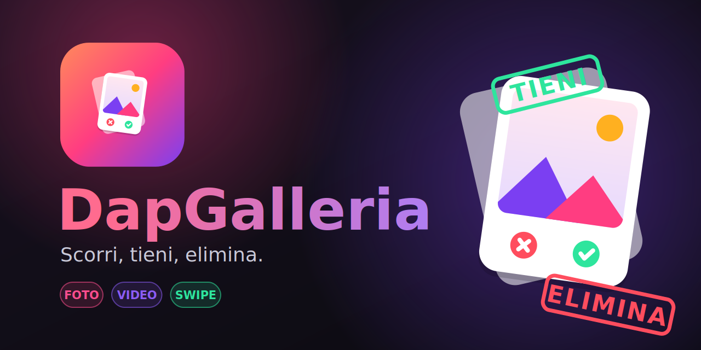

<div align="center">



<br>

[](https://github.com/cammo22/DapGalleria/actions/workflows/build.yml)
[](https://github.com/cammo22/DapGalleria/releases/latest)
[](https://github.com/cammo22/DapGalleria/releases)


[](LICENSE)

**Pulisci la galleria del telefono come se fosse un’app di incontri.**<br>
Una foto alla volta: a destra la tieni, a sinistra la mandi nel cestino della sessione.

[**⬇️ Scarica l’APK**](https://github.com/cammo22/DapGalleria/releases/latest) · [Come funziona](#-come-funziona) · [Compilare da sorgente](#-compilare-da-sorgente)

</div>

---

## ✨ Cosa fa

- **Swipe stile Tinder** su tutte le foto e i video del telefono: trascina la carta a destra per **tenere**, a sinistra per **eliminare**. Ci sono anche i pulsanti per chi preferisce toccare.
- **Modalità Foto e modalità Video** con un tocco: nella seconda i video partono da soli, in loop, con tocco per la pausa e pulsante audio (di default sono muti, così non disturbi nessuno).
- **Eliminazione in due tempi, senza rischi.** Uno swipe a sinistra *non cancella nulla*: il contenuto viene solo marchiato. Quando hai finito, apri la lista “Da eliminare” e confermi tutto in un colpo.
- **Revisione veloce della sessione.** Griglia con tutte le miniature marchiate, dimensione totale che libererai, anteprima a schermo intero (video compresi) e filtro Tutti / Foto / Video.
- **Hai swipato per sbaglio?** Tocca la ✕ su una miniatura per **toglierla dalla lista**, oppure usa il pulsante **Annulla** per tornare indietro di uno swipe mentre scorri.
- **Le decisioni restano salvate.** Se chiudi l’app, i contenuti marchiati sono ancora lì e quelli già tenuti non ti vengono riproposti.
- **Ordine recente o casuale**, con l’opzione di rivedere anche i contenuti già tenuti.
- **Privata al 100%**: nessun account, nessuna connessione a internet, niente analytics.

## 🧭 Come funziona

```
   ┌──────────┐   swipe ←    ┌───────────────────┐   conferma    ┌─────────────────┐
   │  Mazzo   │ ───────────▶ │  Da eliminare     │ ────────────▶ │  Eliminati      │
   │ foto/video│              │  (marchiati)      │               │  definitivamente│
   └──────────┘              └───────────────────┘               └─────────────────┘
        │ swipe →                    │ ✕ “togli dalla lista”
        ▼                            ▼
     Tenuti  ◀───────────────────────┘
```

| Gesto / pulsante | Effetto |
| --- | --- |
| Swipe a **destra** o ✓ | **Tieni**: il contenuto non viene più riproposto |
| Swipe a **sinistra** o ✕ | **Marchia** come da eliminare (non è ancora cancellato) |
| ↩︎ Annulla | Torna all’ultimo contenuto e annulla la decisione |
| 🗑 in alto a destra | Apre la lista “Da eliminare” con il numero di elementi |
| Tocco su un video | Pausa / riprendi |
| Tocco su una miniatura | Anteprima a schermo intero |
| ✕ su una miniatura | Toglie quel contenuto dalla lista (resta nella galleria) |
| **Elimina definitivamente** | Chiede conferma ad Android e cancella i file selezionati |

> **Nota sull’eliminazione.** Da Android 11 in poi è il sistema stesso a mostrare la richiesta di conferma per cancellare i file; su Android 10 la conferma può essere richiesta file per file. I contenuti eliminati **non** passano da un cestino dell’app.

## 📲 Installazione

1. Apri la pagina delle [**Releases**](https://github.com/cammo22/DapGalleria/releases/latest) dal telefono e scarica `DapGalleria-vX.Y.Z.apk`.
2. Aprilo e, se Android lo chiede, consenti l’installazione da questa fonte.
3. Concedi l’accesso a foto e video e inizia a fare swipe.

Requisiti: **Android 8.0 (API 26)** o successivo. Accanto all’APK trovi anche il checksum `.sha256` per verificarne l’integrità.

## 🔐 Permessi e privacy

| Permesso | Perché serve |
| --- | --- |
| `READ_MEDIA_IMAGES` / `READ_MEDIA_VIDEO` (Android 13+) · `READ_EXTERNAL_STORAGE` (fino ad Android 12) | Mostrare le tue foto e i tuoi video |
| `WRITE_EXTERNAL_STORAGE` (solo Android 8–9) | Poter eliminare i file; dalle versioni successive lo fa il sistema con la sua conferma |

L’app **non ha il permesso `INTERNET`**: non può inviare nulla fuori dal telefono. Le uniche informazioni salvate sono gli identificativi dei contenuti tenuti / marchiati, in una piccola preferenza locale.

## 🛠 Compilare da sorgente

Serve **JDK 17** e l’**Android SDK** (Android Studio li include entrambi).

```bash
git clone https://github.com/cammo22/DapGalleria.git
cd DapGalleria
./gradlew assembleDebug        # APK in app/build/outputs/apk/debug/
```

Oppure apri la cartella con Android Studio e premi ▶︎.

### Stack

- **Kotlin** + **Jetpack Compose** (Material 3, tema scuro)
- **Coil** per le miniature (anche dei video) e **Media3 / ExoPlayer** per la riproduzione
- **MediaStore** per leggere la galleria e `createDeleteRequest` per l’eliminazione sicura
- Architettura semplice: `ViewModel` + `StateFlow`

<details>
<summary><b>Struttura del progetto</b></summary>

```
app/src/main/java/com/dapprod/dapgalleria/
├── MainActivity.kt          permessi, navigazione tra mazzo e lista “Da eliminare”
├── DapGalleriaApp.kt        ImageLoader di Coil (con decoder dei fotogrammi video)
├── data/
│   ├── MediaRepository.kt   legge foto e video da MediaStore
│   ├── MediaDeleter.kt      eliminazione definitiva (Android 8 → 15)
│   └── SessionStore.kt      decisioni e impostazioni su disco
└── ui/
    ├── GalleryViewModel.kt  mazzo, swipe, annulla, lista da eliminare
    ├── components/          carta, mazzo con gesture, player video
    └── screens/             schermata swipe, revisione, permessi, anteprima
tools/                       script che generano icona e banner
```

</details>

## 🚀 Release automatiche

Ogni volta che viene pubblicato un tag `vX.Y.Z`, GitHub Actions compila l’APK firmato e crea da solo la release con APK, checksum e note generate dai commit:

```bash
git tag v1.1.0
git push origin v1.1.0      # …e la release si pubblica da sola
```

Si può anche lanciare a mano da **Actions → Release → Run workflow**. Il numero di versione dell’app è preso dal tag.

### Firma stabile degli aggiornamenti (consigliato)

Senza configurazione la CI firma ogni release con una chiave temporanea: l’APK è installabile, ma Android rifiuta di aggiornare sopra una release firmata con una chiave diversa. Per mantenere sempre la stessa firma, genera un keystore **una volta sola** e salvalo nei *Secrets* del repository (Settings → Secrets and variables → Actions):

```bash
keytool -genkeypair -keystore dapgalleria.jks -alias dapgalleria \
        -keyalg RSA -keysize 2048 -validity 10000
base64 -w0 dapgalleria.jks      # incolla l’output in ANDROID_KEYSTORE_BASE64
```

| Secret | Contenuto |
| --- | --- |
| `ANDROID_KEYSTORE_BASE64` | il file `.jks` codificato in base64 |
| `ANDROID_KEYSTORE_PASSWORD` | password del keystore |
| `ANDROID_KEY_ALIAS` | alias della chiave (es. `dapgalleria`) |
| `ANDROID_KEY_PASSWORD` | password della chiave |

Non committare mai il keystore: è già escluso dal `.gitignore`.

## 🗺 Idee per il futuro

- [ ] Filtro per album / cartella
- [ ] Widget “ricordami di fare ordine”
- [ ] Gesto verso l’alto per condividere o spostare in un album
- [ ] Tema chiaro e traduzione in inglese

I contributi sono benvenuti: apri una issue o una pull request.

## 📄 Licenza

Distribuito con licenza [MIT](LICENSE).
